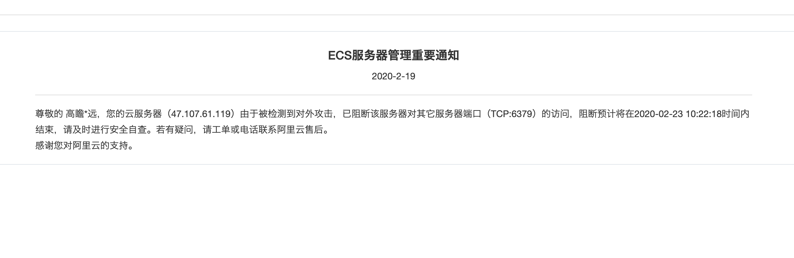

# 20200220变更

## 原因

阿里云服务器上的redis服务器没有设置安全密码，因此有阿里云安全中心报告安全事件：

## 日期
    2020年02月20日
   
## 主题

    增加redis安全密码
    
## 步骤

### 1. 修改redis服务器密码

     redis-cli -h 47.107.61.119
     config set requirepass "leanmarketing-20200220"
     
执行下面的命令验证密码设置是否成功:

     auth leanmarketing-20200220
     
### 2. 为`Java`应用设置`redis`认证密码

 2.1 打开 `src/main/resources/application.properties`
 
 2.2 将原有空字符串的redis密码设置为: 
 
        spring.redis.password=leanmarketing-20200220
        
### 3. 打包应用，重新部署

### 4. 参考[链接](https://learnku.com/articles/35888)

a. 清空所有未知cron定时任务

b. 清理所有未知的 ssh key

## 5. 上传本地打包命令

    scp ./target/lean-marketing-0.0.2-RELEASE.war root@47.107.61.119:/home/wwwroot/pc.leanmarketing.cn/java-leanMarketing

## 6. 启动命令

    nohup java -jar lean-marketing-0.0.2-RELEASE.war 1>/dev/null 2>&1 &
